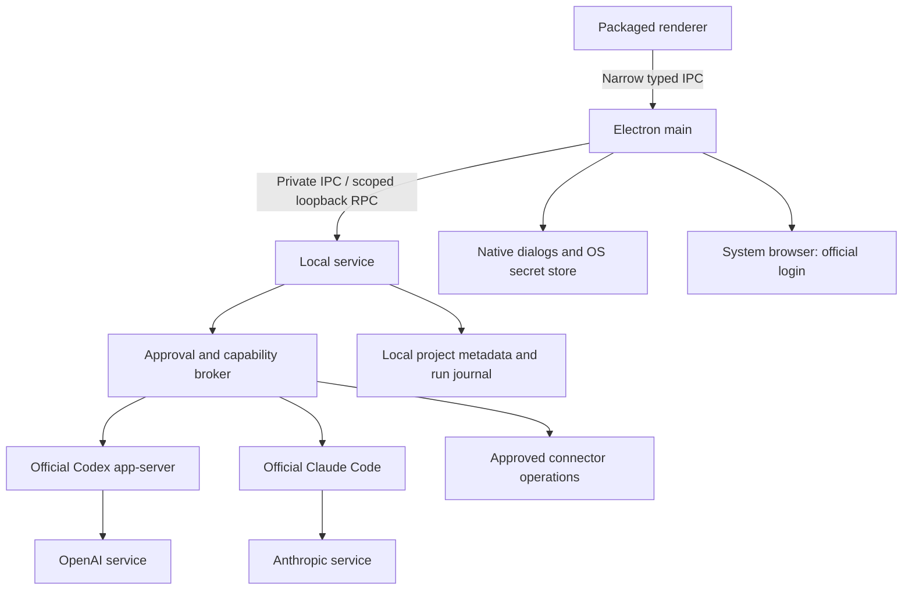

# Foundry Desktop: runtime, authentication, and release architecture

Date: 2026-10-01  
Owner: Desktop Runtime and Authentication Engineer  
Status: Implementation proposal. No runtime changes, installer, signing, deployment, or live authentication test performed.

## 1. Decision

Build a Windows 11 x64 desktop application using Electron, an isolated local service, and the official, unmodified Codex CLI and Claude Code. Package the application and its Node runtime together. Use provider-owned browser login, scoped local profiles, explicit approval gates, and signed updates. Keep the web planning workspace outside the desktop execution boundary.

The current repository is a starting point, not a distributable product. A working browser login is not proof of commercial authorization, sandbox enforcement, or a successful model request. Each needs its own release evidence.

Launch sequence: secure local service → provider adapters and doctor → approval enforcement → signed installer → clean-machine acceptance. Native Windows Codex is the first candidate for sandboxed execution. Claude Code can be connected on Windows, but its native command execution must not be described as sandboxed.

## 2. What was inspected

Read source only in `/home/harel/work/foundry-product` (branch `codex/production-launch`, initial HEAD `ac7c108`) and selected source files under `/home/harel/foundry`. No private state, credentials, transcripts, or live vault records were opened or copied. No server was started or stopped.

| Evidence | Finding | Required change in the product branch |
|---|---|---|
| `docs/PRODUCT_BRIEF.md` | Requires desktop execution, official provider login, safe defaults, and a future SIWC boundary | Preserve these goals; qualify claims with the constraints below |
| Product `package.json` | `main` is `server.js`; only start/dev scripts; no Electron package or installer configuration | Introduce a desktop build, locked dependencies, package allowlist, and Windows release pipeline |
| Product `server.js:13`, `:284`, `:320` | Claude defaults to `bypassPermissions`, inherits the parent environment, and launches through a shell | Replace with effective policy validation, environment allowlists, and explicit executable paths |
| Product `server.js:99` | Persistence includes API keys and OAuth token fields | Persist secret references only; reject token fields in imports/exports |
| Product `server.js:581` | Codex uses `exec --json`; no interactive approval transport is implemented | Use an adapter with a tested approval protocol; prefer official app-server |
| Product `server.js:845–976` | Logout backs up credentials; setup-token returns token material; status can read credential files | Remove these patterns from the commercial build |
| Product `server.js:1241` | Listener has no explicit host; entrypoint loads and writes state | Bind loopback explicitly; split construction, storage, and lifecycle before testing |
| Live-source `desktop/main.js`, `preload.js` | Renderer isolation flags are present; shell loads an existing port 4400 service; export IPC has no complete sender/schema boundary | Retain the isolation intent; implement service ownership, IPC validation, navigation restrictions, and bounded payloads |
| Live-source `desktop/Install-Desktop.ps1`, `launch.cmd` | Shortcut creation and external Node/browser launch; listener detection accepts any process on a fixed port | Replace with an actual installer and authenticated service handshake |
| Live-source `server.js:4591–4613`, `:6387–6466` | Isolated provider profiles exist, but Codex bypass flags, shell login strings, and credential-read fallback remain | Reimplement selected behavior through the safe adapter contract; do not copy the live runtime wholesale |
| Live-source `foundry-vault.js`, `foundry-control-auth.js` | Windows DPAPI support; headless environment-key fallback; scope defaults can be broad | Use Windows OS protection, narrow scopes, and no inherited developer vault/environment |
| Live-source `server.js:7807–7832` | Can bind a discovered tailnet interface | Desktop release binds loopback only; remote control is outside launch scope |

Line numbers identify the inspected snapshots and may move. This was a targeted architecture inspection, not a full security audit. The live implementation is more extensive than the product checkout; neither should be treated as the other's tested behavior. At final verification, concurrent work had modified `package.json` and `server.js` and added `core/` and `desktop/`; those changes were not part of this review or authored by this task.

## 3. Provider and commercial boundaries

### Codex CLI

The official Codex source is Apache-2.0 licensed. Preserve the license and applicable notices for the exact distributed release and its dependencies. That software license does not grant service entitlement, unlimited usage, or rights to resell ChatGPT access. Use the official CLI with each user's own eligible account; commercial distribution review must cover the final integration and current service terms. [Official Codex license](https://github.com/openai/codex/blob/main/LICENSE)

Official authentication supports ChatGPT login and separate API billing. The proposed desktop path uses CLI-managed login and never extracts its tokens for direct HTTP inference. Do not promise that a particular plan or model will always be available. [OpenAI authentication documentation](https://learn.chatgpt.com/docs/auth)

### Claude Code

Anthropic explicitly permits preinstalling or running unmodified Claude Code in products subject to its Commercial Terms and stated conditions. Every user must authenticate and pay for their own usage; the host must preserve the binary and its built-in authentication choices. This does not authorize a Foundry-owned Claude.ai OAuth implementation, collecting subscription tokens, or relaying inference through those tokens. Anthropic separately permits users to sign in to the unmodified binary with their subscriptions. Use plain-text attribution without implying endorsement. Release review must confirm this architecture meets those conditions. [Anthropic legal and compliance](https://code.claude.com/docs/en/legal-and-compliance)

Implementation consequence: present “Open Claude Code sign-in.” Let the official binary perform login. Never make a generic “Sign in with Claude” identity service. An API-backed custom Claude adapter is a separate integration with separate billing. Do not assume Agent SDK usage inherits all rights of the unmodified CLI hosting arrangement.

### Future Sign in with ChatGPT (SIWC)

Current official plan-usage documentation addresses open-source/local apps and directs paid or remotely hosted apps to an interest process. Commercial client IDs are available to selected partners. Foundry has no verified partner grant in this task. Therefore the paid build must not ship or activate the OSS plan-usage DevKit, dynamic registration, or direct SIWC inference as a substitute for authorization. [Plan-usage overview](https://developers.openai.com/siwc/token-sharing-open-source), [commercial client access](https://developers.openai.com/siwc/request-client-id)

The brief calls the DevKit noncommercial. Retain that exclusion. This review did not establish an exact DevKit package/version/license text; do not turn the brief into a claim that a particular SDK license was audited. Before any future inclusion, archive that package's actual license and the written commercial grant. Identity login and permission to consume plan usage are distinct capabilities.

### What cannot ship under this plan today

- An enabled commercial SIWC adapter without the required access and license review.
- Private credentials, provider tokens, shared subscription accounts, credential pooling, or a provider-token proxy.
- A modified Claude Code binary, disabled built-in auth methods, or an endorsement claim.
- Promises of unlimited workers' inference, fixed provider quotas, free API usage, or equivalent isolation across providers.
- A “signed Windows release” before an actual signed installer passes clean-machine checks. This document does not supply a signing identity.

Foundry can charge for its own orchestration features; that is a product proposal, not proof that every provider integration is commercially cleared. Keep license entitlements separate from provider authentication. A Foundry subscription must never unlock another user's inference credentials.

## 4. Process and trust architecture



Proposed module ownership:

| Module | Owns | Must not expose |
|---|---|---|
| `desktop/main` | Window, dialogs, browser opening, service supervision, updates | Generic shell/file/HTTP IPC |
| `desktop/preload` | Small typed request/event surface | `ipcRenderer`, Node objects, raw event objects, secret handles usable by arbitrary code |
| `runtime/service` | Project state, queues, run journal, adapters | Public network listener or arbitrary executable selection |
| `runtime/policy` | Folder grants, action approvals, expiry, audit decisions | Model-generated approvals treated as human consent |
| `runtime/providers/*` | Versioned CLI protocol and capabilities | Tokens in UI events, logs, or exported project data |
| `runtime/secrets` | OS-protected Foundry secrets and references | Bulk vault export or environment injection into every child |
| `runtime/doctor` | Bounded diagnostics and repair proposals | Silent reinstall, logout, profile deletion, or credential reading |

Use Electron's packaged Node runtime through `utilityProcess.fork` for the service. This removes the user's Node/npm prerequisite. Keep third-party executables outside ASAR, resolved by absolute path from a signed distribution manifest. A utility process separates crashes; it is not an OS sandbox for arbitrary agent commands. [Electron utilityProcess](https://www.electronjs.org/docs/latest/api/utility-process)

Serve the renderer from a registered secure local application protocol. Use `contextIsolation: true`, `nodeIntegration: false`, `sandbox: true`, a restrictive CSP, and packaged scripts/fonts. Validate IPC sender frame, origin, schema, payload length, and operation ownership. Deny navigation, new windows, and permissions by default. Open external HTTPS URLs only through explicit typed actions and validated destinations. Generated HTML previews receive no preload bridge. [Electron security guidance](https://www.electronjs.org/docs/latest/tutorial/security)

Electron renderer isolation does not isolate the local service or its CLI children. Those need the separate execution policy in section 8.

## 5. Installer and bundled components

### Initial supported target

Windows 11 x64, standard user, per-user install. ARM64 and Windows 10 require separate acceptance runs before being advertised. Installation of Foundry itself needs no administrator access; Codex's stronger sandbox setup may request it separately. WSL is an optional capability with explicit setup, not a hidden first-run prerequisite.

Use an assisted, full-payload NSIS installer through a pinned stable `electron-builder` and `electron-updater` pair. Include a Start Menu entry, Apps & Features uninstall entry, optional desktop shortcut, versioned product identity, and repair/reinstall instructions. Do not use a ZIP or shortcut script as the public installer. NSIS is supported by electron-updater. The currently fetched unversioned builder docs describe unreleased v27, so implement against pinned stable v26 documentation unless a later release is deliberately adopted. [Stable updater documentation](https://www.electron.build/v26/docs/features/auto-update/)

### Distribution manifest

| Component | Strategy | Release evidence |
|---|---|---|
| Electron + bundled Node/Chromium | Included with exact versions and lockfile | Licenses, dependency inventory, vulnerability review |
| Foundry UI/service | Included from an explicit file allowlist | Source revision, hashes, no environment-specific modules |
| Codex | Official pinned Windows executable and required companion files | Upstream provenance, hash, license/NOTICE, protocol tests |
| Claude Code | Official unmodified binary after commercial review; otherwise user installs from official flow | Distribution permission, original integrity, complete built-in auth choices |
| Git Bash | Optional user dependency; do not silently bundle | If later bundled, perform its own license/source-obligation review |
| WSL2 and Linux sandbox packages | Optional user/administrator setup | Doctor verifies availability; no silent OS changes |

Claude's current setup docs allow native Windows without Git for Windows, using PowerShell; Git Bash is optional. Native and package-manager installs have different update behavior. Validate the chosen installation channel instead of assuming all CLI installations are immutable. [Claude setup](https://code.claude.com/docs/en/setup)

The no-Node prerequisite applies to Foundry and its supported native engines, not to every future mission's toolchain. Detect missing Python, Git, or build tools per mission and show the exact dependency before installation.

### Signing and release preparation

Build on a clean Windows runner from an allowlisted checkout, never `/home/harel/foundry`. Use locked package installation, a dependency inventory/SBOM, third-party notices, and an extracted-installer secret scan. Exclude all state files, vaults, credentials, account directories, transcripts, logs, uploads, private URLs, business modules, and development launch scripts. An allowlist is required in addition to a denylist.

Sign Foundry executables, native helpers, installer, and uninstaller with the approved publisher identity and timestamp. Preserve provider binaries as published; verify their upstream integrity and protect their bundled hashes through Foundry's signed artifact. Require code signing at build time and verify Authenticode after extraction. Keep signing keys in an HSM/cloud signing service or secured release runner, never the repo or application. Confirm the legal entity is eligible for the selected signing service; no service or certificate has been purchased here. [Windows signing](https://www.electron.build/v26/docs/features/code-signing/code-signing-win/)

A valid signature does not guarantee that Windows will show no reputation warning. Test the downloaded artifact on a fresh machine, including Mark-of-the-Web behavior. Build scripts must default to no publishing; release upload and promotion require a separate authorized action.

## 6. Provider adapters and browser login

The following is a proposed internal interface, not a provider API:

```ts
interface ProviderAdapter {
  probe(): Promise<Capabilities>;
  beginLogin(profileId: string): Promise<LoginAttempt>;
  cancelLogin(attemptId: string): Promise<void>;
  authStatus(profileId: string): Promise<AuthStatus>;
  logout(profileId: string): Promise<void>;
  startRun(request: ApprovedRun): AsyncIterable<RunEvent>;
  resolveApproval(requestId: string, decision: HumanDecision): Promise<void>;
  cancelRun(runId: string): Promise<void>;
}
```

Capabilities include binary version/hash, authentication method, account identity when supplied, protocol version, execution environment, sandbox availability, approval transport, and usage visibility. Unknown fields remain unknown. Separate `installed`, `signed-in`, `eligible`, `verified-for-run`, and `rate-limited` states.

### Codex adapter

Launch `codex app-server` over private stdio. Perform its initialization handshake and use the schema generated for the pinned binary. Start provider login with `account/login/start` and type `chatgpt`; open the returned official authorization URL in the system browser. The provider hosts its callback. Match completion to the pending login ID, then confirm account status. Use the documented cancel/logout operations. Device-code login is an explicit fallback only when the account and CLI support it. Forward provider approval requests to the trusted UI and responses back to the matching request. [Official app-server protocol](https://learn.chatgpt.com/docs/app-server)

Do not use externally managed ChatGPT-token modes in the launch adapter. Do not implement an OAuth callback by borrowing Codex's client identity. No token crosses into renderer memory. Login URLs may contain sensitive parameters: never persist or include them in diagnostics. Run stdin/stdout is a private protocol, not a public endpoint.

Set a dedicated `CODEX_HOME` for each Foundry profile. Require `cli_auth_credentials_store = "keyring"`; if unavailable, fail with a repair action rather than silently falling back to plaintext. Verify separate homes also provide separate keyring identity and logout behavior in the chosen release. [Credential storage](https://learn.chatgpt.com/docs/auth)

### Claude Code adapter

Launch the unmodified official executable with `claude auth login` in its own `CLAUDE_CONFIG_DIR`. Preserve the official authentication chooser; do not force a subscription-only flag. If it needs terminal interaction or a fallback code, show the official terminal flow without recording it. Check connection with `claude auth status`; use the pinned release's documented output schema and `claude auth logout` for disconnect. Do not infer login from a file's existence or an email-shaped string. [Claude CLI reference](https://code.claude.com/docs/en/cli-reference)

Use official `-p` structured output for runs and a tested permission transport, such as the documented `--permission-prompt-tool`. The broker must wait for real human approval; it must not return automatic approval merely because the model requested it. If permission round trips are unavailable, disable mutation-capable runs. Prove this with an intentionally denied action before launch. [Claude permission transport](https://code.claude.com/docs/en/cli-reference)

Provider profiles isolate Claude subscription login/settings. Current documentation warns that separate config directories do not isolate every Console sign-in without an API key. Treat that mode as unsupported for concurrent isolated profiles until tested; display the actual active billing method. [Claude authentication](https://code.claude.com/docs/en/iam)

### Shared login state machine

`not-installed → installing → signed-out → awaiting-provider-login → verifying → connected`

Branches: `cancelled`, `expired`, `network-error`, `organization-blocked`, `unsupported-version`, `storage-unavailable`, `usage-limited`.

Allow one active login per profile. Cancellation stops the owned attempt without deleting an existing working login. A late completion from an older attempt cannot replace the selected profile. Browser opening is not success. A local status probe is not proof of service entitlement. Offer a clearly labeled minimal connection test that can consume quota; do not spend it automatically on every launch.

### Capability-aware continuation and fallback

On quota exhaustion, account failure, or provider interruption, checkpoint mission state, artifact versions/hashes, completed steps, decisions, action receipts, and pending approval records. Preserve the original run and its provenance. A provider switch must not restart the mission from scratch or discard partial work.

Before offering a replacement, compare every remaining step with its current capabilities: tools, filesystem access, sandbox, approval transport, authentication, quota visibility, and billing source. Confirm it can complete those steps under the existing safety requirements. Prior explicit consent naming the providers and project-context scope may authorize automatic fallback. Ask again only when that consent does not cover the switch or its data scope/billing changes. Never silently switch to paid API usage.

Keep pending approvals visible in the journal, but invalidate old execution handles. Reissue any needed request against the replacement run/profile and exact payload; an earlier approval cannot silently expand to another provider. Reconcile partial writes and uncertain external actions before retrying. Deduplicate clicks by operation ID and reject late events from superseded run generations.

Native Windows Claude planning-only mode cannot count as a full execution fallback. If the replacement cannot finish a step, pause that step with a concrete capability explanation and retain all work. Advertise seamless or bidirectional provider continuation only after Codex-to-Claude and Claude-to-Codex tests pass for the exact supported outcome and environment. Until then, narrow launch claims to the proven paths.

## 7. Credentials and local data

Proposed storage, with explicit per-user Windows ACLs:

```text
%LOCALAPPDATA%\Programs\Foundry\       application and versioned runtimes
%LOCALAPPDATA%\Foundry\
  state\                            metadata database and run journal
  profiles\codex\<opaque-id>\       provider-owned configuration
  profiles\claude\<opaque-id>\      provider-owned configuration
  secrets\                          Foundry OS-protected secret records
  logs\                             rotated redacted operational logs
  updates\                          verified pending installers
User-chosen workspace\               deliverables; retained on uninstall
```

Set Electron's data/session paths deliberately. Stable, beta, development, and tests use different app IDs and storage roots. No development fallback points to the owner's existing `.foundry-*` directories. Start fresh; a future migration imports validated non-secret project metadata and requires new provider login.

Claude Code on Windows stores credentials in its own profile JSON with filesystem access controls. That is provider-owned file storage, not a claim of DPAPI encryption. Foundry must not read, copy, re-encrypt, back up, or export that credential file. [Claude credential management](https://code.claude.com/docs/en/iam)

Use Electron safeStorage/Windows DPAPI for Foundry-owned API keys and connector secrets. Store opaque references in application state. Fail closed if encryption is unavailable. DPAPI protects against other Windows users, not arbitrary malware running as the same user. Do not advertise same-user process isolation merely because a file is encrypted. [Electron safeStorage](https://www.electronjs.org/docs/latest/api/safe-storage)

Construct each child environment from a small allowlist: required OS paths, locale, temp location, curated tool PATH, and the selected profile. Never spread `process.env`. Exclude provider keys, proxy overrides, cloud credentials, `NODE_OPTIONS`, `ELECTRON_RUN_AS_NODE`, developer control tokens, and vault master keys unless that precise adapter needs an explicitly approved value. Do not invoke login shells that reload developer secrets.

Prefer connector calls through the approval broker, which injects a narrowly scoped credential only for the approved operation. Do not put marketing/store/payment secrets in model subprocesses. If advanced API mode injects a provider key, disclose that child processes may inherit it and apply the strongest supported sandbox. Never put secret values in command-line arguments.

Credential directories and app state are excluded from workspace grants, search, attachments, backups, web handoffs, and diagnostics. Same-user unsandboxed execution can still read them: this is a material reason to restrict native Claude execution, not a problem solved by UI hiding.

## 8. Sandbox and approval defaults

### Policy model

Every mission starts with a chosen folder and a reviewable plan. Human approval can grant edits inside that folder for this run. It does not grant publishing, spending, sending messages, deleting outside the folder, accessing other credentials, or running arbitrary elevated commands.

| Capability | Default |
|---|---|
| Read the approved workspace | Allowed after folder selection; secrets excluded |
| Generate draft files in approved output folder | Only after plan/folder approval |
| Shell commands, dependency installation | Require a tested sandbox and policy review; unknown commands ask |
| Access additional directories | Native picker plus explicit grant |
| Network from agent tools | Denied unless the destination/capability is approved |
| Publish, send, spend, refund, production mutation | Fresh action-specific approval showing target and exact payload |
| New MCP servers, hooks, plugins, skills with execution | Disabled until source and capabilities are reviewed |
| Scheduled actions | Off initially; same policy as manual runs, pause when approval is unavailable |
| Full-access or bypass modes | Not available in the initial commercial build |

Bind each approval to run/profile, canonical folder/target, operation parameters, payload hash, expiry, and one-use nonce. Reject replay, changed payloads, stale approvals, or decisions from another window. Persist the decision and action result without secrets. Never treat a prompt, teammate message, imported mission, or model-generated JSON as human consent.

Arbitrary shell/network access can hide consequential actions. Therefore the product cannot honestly guarantee “every consequential action asks” if it also grants unrestricted shell and network access. Keep those capabilities constrained and route supported external writes through the broker. Unsupported workflows stop with an explanation.

### Codex

Use explicit read-only planning, then workspace-write execution with provider approvals and restricted network. For the pinned schema, validate the effective equivalent of `sandbox_mode = "workspace-write"` and `approval_policy = "untrusted"`; map configuration names through versioned adapter tests. Never inherit a user's permissive defaults or use bypass flags.

Official Windows documentation prefers the elevated sandbox, with dedicated low-privilege users and firewall controls; setup needs administrator approval. The unelevated fallback has weaker network isolation. Doctor must report the effective mode. Declining setup keeps planning available; any fallback must be visibly selected and tested rather than silently labeled equivalent. [Codex Windows sandbox](https://learn.chatgpt.com/docs/windows/windows-sandbox)

### Claude Code

Use `default` permission mode, not `bypassPermissions` or `acceptEdits` as a blanket launch default. Claude's built-in Bash sandbox supports WSL2/Linux/macOS, not native Windows. [Claude sandbox documentation](https://code.claude.com/docs/en/sandboxing)

For initial native Windows support, expose planning with mutation and command tools disabled. Treat even this as permission-limited, not an OS sandbox. Full native execution remains blocked until a separately reviewed isolation solution exists. A WSL2 execution option may follow after its own acceptance gate: Linux CLI/profile, required sandbox dependencies, enforced network rules, restricted mounts, blocked Windows interop escape, and no unsandboxed retry. Do not assume WSL alone is isolation or transplant Windows credentials into it.

This means the launch promise must state which provider can execute which outcomes. Browser login can succeed while a mission remains unavailable for safety reasons.

## 9. Local service lifecycle

1. Acquire Electron's single-instance lock. A second launch focuses the first window; it never starts another scheduler or replays a mission.
2. Show the packaged shell immediately. Start one owned service utility process with a sanitized environment and private bootstrap IPC.
3. Prefer private IPC for control. If retaining HTTP during refactoring, bind `127.0.0.1` on an OS-assigned port. Generate a 256-bit session capability and pass it only over inherited IPC. Main proxies typed calls; the renderer never receives the capability.
4. Require authentication on every sensitive endpoint, including event streams. Validate Host/Origin, reject unexpected browser origins, disable wildcard CORS, cap request size, and prevent path traversal. Loopback is not authentication.
5. Verify a handshake containing the launch nonce, protocol version, build ID, and owned process identity. A listening port or HTTP 200 is insufficient. Never adopt or kill an unrelated listener.
6. Bound startup to a proposed 15-second deadline. Show actionable diagnosis on failure. Restart only the owned service, with bounded retries; do not auto-replay interrupted writes.
7. Journal run transitions and pending actions durably. Use SQLite transactions or equivalent atomic persistence rather than rewriting state with embedded secrets. After a crash, mark actions interrupted/unknown and reconcile side effects before resuming.
8. On exit, stop scheduling, cancel provider work, deny pending approvals, flush the journal, close endpoints, and terminate owned process trees. Use a tested Windows Job Object/process supervisor with kill-on-close semantics; a PID alone is not ownership proof.

Schedules run only while the application is running and the machine is awake. “Close to tray” and start-at-login are explicit opt-ins. Initial release installs no Windows service and does not run after logout. Sleep/wake, network changes, and expired login return to a recoverable paused state.

Proposed performance acceptance targets, not measurements: visible shell within 2 seconds on the reference Windows machine, user-action feedback within 100 ms, cancellation acknowledged within 1 second. Provider completion time is shown separately. Polling, encryption, log export, and dependency probing must not block the renderer.

## 10. Connection doctor

Doctor produces structured checks: `pass | warning | blocked | unknown`, observed time, safe evidence, and a specific next action. Cache inexpensive results; run independent checks concurrently with deadlines. No raw stdout dump is a diagnostic report.

| Check | Safe evidence | Repair offered |
|---|---|---|
| Installation integrity | Version, architecture, signed-manifest hash match | Reinstall a verified runtime |
| Service health | Build/protocol match, authenticated round trip | Restart owned service |
| Provider availability | Absolute executable path and version | Open official installation flow |
| Profile/auth | Provider-reported status and redacted account label | Open official login/logout |
| Authentication source | Subscription/API/cloud method when reported | Explain mismatched billing; no silent switch |
| Secure storage | Keyring/DPAPI readiness; ACL metadata | Repair permissions or reconnect; never read tokens |
| Sandbox | Actual engine/environment/mode and denied-operation test result | Provider setup or supported environment |
| Approval transport | Synthetic request can be denied, times out closed | Block execution until repaired |
| Connectivity | DNS/TLS/proxy/clock checks without credentials in output | Explain local network/clock problem |
| Entitlement and limits | Provider-reported state, otherwise unknown | Link to official account controls; optional quota-consuming test |
| Workspace | Canonical path, access, free space, reparse-point checks | Choose a valid folder |
| Updates | Channel, current/candidate version, verification result | Retry or keep current verified build |

Normal doctor runs do not reinstall, erase, log out, open firewall rules, change system policy, or make inference calls. Repair actions are explicit and cancellable. Support export is previewable and local-only; omit prompts, transcripts, filenames, usernames, account emails, tokens, authorization URLs, environment dumps, and customer content. Include error categories and component versions. Use seeded fake secrets to test redaction.

## 11. Updates and recovery

Use `electron-updater` with full NSIS artifacts, HTTPS, an explicit release feed, expected publisher validation, and artifact hashes. No private GitHub token or cloud upload credential belongs in the client. Stable and beta feeds/storage stay separate. Updates must never change provider accounts or expand permissions.

Initially disable automatic installation on quit and require a visible restart/install action at an idle checkpoint. Version-pin the supported updater API; do not copy unreleased v27-only options into a stable v26 build. Avoid updating during Windows shutdown. Keep a verified previous installer and a pre-migration metadata backup; provider credentials are excluded. Schema migrations must be reversible or reject older binaries safely. NSIS installation is not assumed power-loss atomic.

Reject wrong publisher, checksum mismatch, malformed metadata, architecture mismatch, replayed older releases, and unexpected host redirects. For authenticated metadata beyond TLS, add a separately reviewed signed-manifest layer or adopt a stable updater release that supports it; a downloaded checksum by itself is not a signature. Rotate signing/feed keys through a tested transition. Security QA must test tampered and truncated downloads.

CLI updates are separate from app updates. Record a compatibility range and re-probe on every version change. Preserve upstream update behavior unless a documented supported control is chosen. Never swap a provider binary during an active run. If a user-installed CLI changes outside the tested range, pause affected execution with a repair option, without deleting its profile.

Release promotion, staged rollout, and withdrawal remain manual authorized operations. This task creates no feed, uploads no artifacts, and deploys nothing.

## 12. Clean uninstall

Uninstall stops only owned processes, disables Foundry-created startup entries/schedules, unregisters Foundry protocols and shortcuts, and removes the installation and caches. Maintain an ownership manifest so cleanup never deletes shared dependencies or arbitrary paths.

Offer two explicit choices: remove application only (retain local projects/settings), or also remove Foundry local data and its dedicated profiles. Explain retained sign-in state when choosing the first. Before profile removal, invoke official provider logout when available; remove Foundry-specific keyring items through documented provider behavior. Do not inspect tokens to perform cleanup.

Never delete user-selected workspaces, exported deliverables, global `~/.codex`/`~/.claude` profiles, shared Git/Node installations, or unrelated WSL distributions. Deleting local credentials does not prove remote token revocation; show provider account controls when needed. If Codex setup installed shared sandbox users/firewall policy, use a supported provider cleanup path only when ownership and lack of other users are established; otherwise disclose that shared prerequisite remains.

Test uninstall from Windows Settings, application-not-running, application-running, partial install, reinstall after retain-data, and full-data removal. Do not promise forensic erasure from SSDs, backups, or provider services.

## 13. Future SIWC adapter boundary

Reserve `providers/openai-siwc` as a disabled interface boundary with no SDK dependency, production client registration, or tokens. It may implement identity and/or inference capabilities later; those flags must be separate from `codex-cli` and from Foundry license identity.

Activation gates: written commercial access, verified package license, approved branding, provider-supported desktop public-client design, reviewed credential storage/refresh/revocation, and acceptance tests. A desktop executable cannot keep a client secret confidential. A provider flow requiring confidential credentials needs a separately designed trusted backend; never embed those credentials in Electron.

Future adapter requests a new explicit consent grant. It does not import Codex auth files or silently reuse its tokens. Keep identity, plan-usage consent, model availability, limits, and billing source distinct. PKCE, state/nonce validation, callback replay defense, token audience/issuer checks, and revocation tests belong to that future provider-specific implementation, not to a homegrown replacement for today's CLI login.

Web-to-desktop handoff contains only versioned mission content and user-selected attachments. Validate schema, size, paths, and provenance; strip executable hooks, permissions, and all credentials. Import never starts execution. Desktop repeats folder selection and plan approval. Web login alone provides no local-file capability.

## 14. Implementation work packages and release proof

| Order / owner | Deliverable | Exit evidence |
|---|---|---|
| 1. Product Lead + Security QA | Commercial integration review, scoped launch claims, redistribution inventory | Recorded decisions for Codex, Claude binary, SIWC exclusion, signing identity |
| 2. Desktop Engineer | Side-effect-free service entrypoint, storage roots, environment builder, Electron supervisor | Starts on clean Windows without Node; rejects foreign service; shutdown leaves no owned workers |
| 3. Desktop + Onboarding | Provider adapters, official login, doctor, structured connection states | Browser login/cancel/logout for each supported method; profile A/B isolation; no secrets in UI/logs |
| 4. Desktop + Security QA | Broker, folder grants, sandbox and approval enforcement | Denied commands stay denied; no silent sandbox fallback; malicious workspace and replay tests pass |
| 5. Desktop + Release QA | NSIS/signing/update/uninstall pipeline | Actual signed artifact, clean installation, verified update, tamper rejection, retain/remove-data uninstall |
| 6. Onboarding + Web + Product Lead | Accurate capability copy and explicit handoff | UI at 375 px, 390 px, desktop; handoff cannot auto-run; screenshots correspond to tested build |

These are proposed responsibilities, not completed assignments or time estimates. Runtime implementation requires a subsequent approved task.

Minimum release matrix:

- Fresh Windows 11 standard user; no Node/npm/Git; supported architecture; account name and workspace containing spaces, Hebrew, and non-ASCII characters.
- Sandbox setup accepted, declined, and enterprise-blocked; Codex effective modes distinguished; native Claude never shown as sandboxed.
- Both provider logins; browser closed; callback blocked; cancellation; expired/revoked account; wrong account; quota exhaustion; network loss; no automatic paid API fallback.
- Malicious PATH executable; shell metacharacters in folder/model/input; inherited fake developer keys; malicious project hooks/MCP/config; junction/symlink escape; foreign loopback requests and IPC senders.
- Model attempts to approve itself, reuse an approval, change a send payload, access credential files, or contact an unapproved external endpoint.
- Crash before/after a consequential request; no duplicate send/write after restart; force quit and sleep/wake; two simultaneous app launches; pending approval at shutdown.
- Continuation after quota exhaustion, partial writes, duplicate clicks, late provider events, and restart in both provider directions. Require no lost work, duplicate actions, or permission expansion. An incapable replacement pauses clearly; a preserved pending approval never becomes an automatic grant.
- Update with wrong publisher/hash, truncated download, unavailable feed, migration failure, and interrupted installer. Recovery has a tested manual reinstall path.
- Extracted package scan and local diagnostic-export scan using fake canary secrets. No real provider credentials or customer messages in QA fixtures.
- Full uninstall and retain-data reinstall. External workspaces and unrelated CLI logins survive.

For every release, record OS/build, component versions/hashes, effective sandbox, signed artifact identity, test results, and unresolved limitations. Screenshots alone do not prove authentication, isolation, or signing.

## 15. Completion state of this task

Completed: read-only source inspection, official documentation review, and this implementation plan. This task made no runtime edits. No installer was built, signed, uploaded, installed, or deployed by this task. No Windows runtime behavior or provider login was exercised. Commercial approval, signing identity, packaging, and the acceptance matrix remain release gates.
